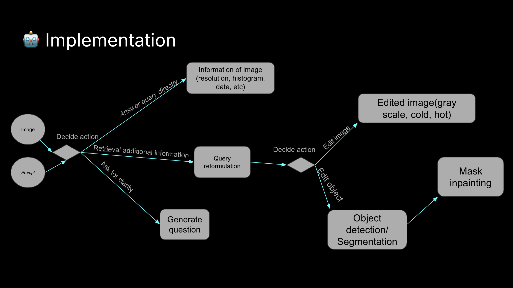

# Image Editing Assistant

A modular Python application that uses Google's Gemini API to perform intelligent image editing operations including analysis, global adjustments, and local object manipulation.

## Features

- 🤖 **Intelligent Routing**: Automatically determines the right editing approach
- 📊 **Image Analysis**: Detailed image information and content analysis
- 🌈 **Global Edits**: Brightness, contrast, saturation, and color temperature adjustments
- 🎯 **Local Edits**: Object detection and inpainting for targeted modifications
- 💬 **Chat-based Editing**: Interactive conversational editing sessions

## Quick Start

### 1. Installation

```bash
# Clone or download the project files
# Install dependencies using UV (Python package manager)
uv sync
```

### 2. Configuration

```bash
# Copy the environment template
cp .env.example .env

# Edit .env and add your API key
# .env file:
GEMINI_API_KEY="your_actual_api_key_here"
# Gemini API information: https://gemini.readthedocs.io/en/latest/
```

### Running Scripts

This project uses `uv` for Python package management. When running Python scripts or managing dependencies, use `uv run` commands:

```bash
# Run the CLI interface (without GUI)
uv run main.py
```

## Gradio UI Interface

### Usage

Launch the modern Gradio web interface:

```bash
# Launch the web UI
uv run launch_ui.py [--use-gemini-local-edit]
```

Then open your browser to `http://localhost:7860` to access the interface.

**Web UI Features:**

- 📤 **Image Upload**: Upload images via drag-and-drop, file browser, or webcam
- 🖌️ **Mask Drawing**: Built-in brush and eraser tools for precise inpainting masks
- 💬 **Chat Interface**: Real-time conversation with the AI assistant
- 🔄 **Live Updates**: See edits applied in real-time
- 📥 **Download**: Save your edited images instantly
- 🎛️ **Image Tools**: Crop, flip, rotate, and transform images

## Agent Architecture



## Agent Responsibilities

### Router Agent

- Analyzes user prompts to determine the appropriate editing action
- Routes requests to the appropriate specialized agent: info, global_edit, local_edit, or advanced
- Uses Gemini API to understand user intent and select the best agent for the task

### Info Agent

- Analyzes images to provide detailed information about content and characteristics
- Generates concise descriptions (under 150 words) in a single paragraph format
- Identifies objects, scenes, colors, lighting conditions, and other visual elements

### Global Edit Agent

- Performs whole-image adjustments like brightness, contrast, saturation
- Handles color temperature, sharpness, and other global parameters
- Applies filters and overall image enhancements

### Local Edit Agent

- Performs targeted edits on specific objects or regions
- Handles object detection, selection, and manipulation
- Supports inpainting for object removal and replacement
